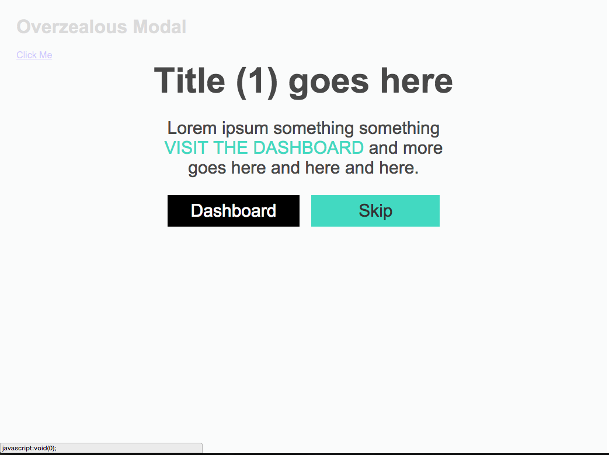

# Overzealous Modal
Large modal for user feedback



<br>
##GETTING STARTED	
Grab the minified css and js in the "dist" folder.
#####HTML
```
<div id="ozm-1" style="display:none">
	<h1>Title (1) goes here <span class="icon-ok"></span></h1>
	<p>
		Lorem ipsum something something <span class="highlight">visit the dashboard</span> and more goes here and here and here.
	</p>
</div>
```
#####JS
```
$('#ozm-1').overzealous({
	buttons:{
    	primary:{
    		text:'Dashboard',
    		classes:'custom css classes',
    		action:function(){
    			alert('primary action');
    		}
    	},
    	secondary:{
    		text:'Skip',
    		classes:'custom css classes',
	    	action:function(){
	    		alert('secondary action');
	    	}
    	}
    }
});
```
